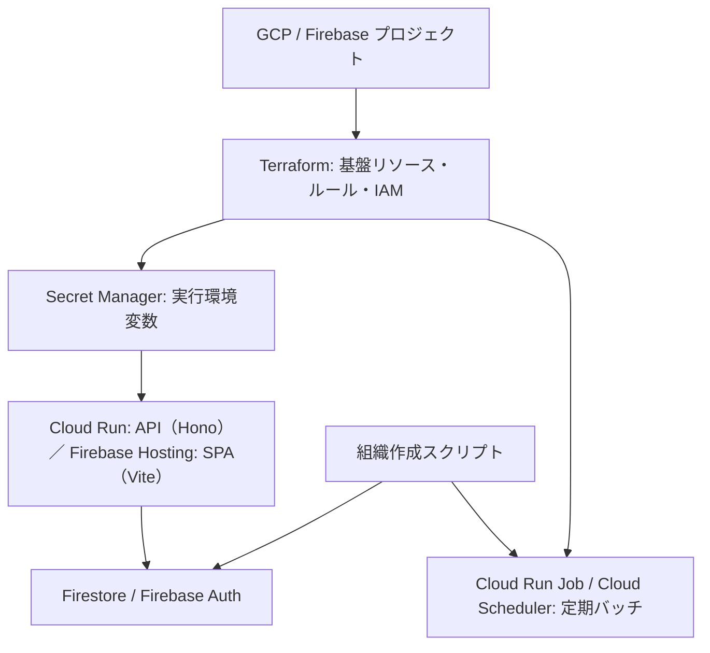

# システム環境構築・組織作成ガイド

このドキュメントは、Arc - みらい予報をローカルで起動し、Firebase / GCP 上の環境を用意して、最初の組織を利用可能にするまでの運用手順です。

> 対象環境は `dev`（`mirai-yoho-dev`）と `prod`（`mirai-yoho-prod`）です。開発・検証は必ず `dev` で行い、本番の Secret、Firestore、Firebase Auth を開発環境と共有しません。

## 全体像




組織を追加する時は、Firestore に組織・初期管理者・初期設定を作るだけでは完了しません。定期バッチを使う環境では、Terraform の `organization_ids` にも組織 ID を追加して apply します。

## 1. 事前準備

### 必要なツール

- Node.js 24.14.0、pnpm（`[mise.toml](../mise.toml)` を参照）
- Firebase CLI
- Google Cloud CLI（`gcloud`）
- Terraform 1.6 以上
- 対象 GCP プロジェクトを操作できる Google アカウント

Node.js / pnpm は mise を使う場合、リポジトリ直下で次を実行します。

```bash
mise install
pnpm install
```

`pnpm install` 時には Panda CSS と Orval の生成処理も実行されます。生成物の `packages/api-client/src/generated/` は手で変更しません。

### Firebase / 外部サービスで用意するもの

環境ごとに、次の値を準備します。Secret の値をリポジトリ、Issue、チャットに貼り付けないでください。


| 区分              | 必要な値                                                                           | 用途                             |
| --------------- | ------------------------------------------------------------------------------ | ------------------------------ |
| Firebase Client | API key、Auth domain、Project ID                                                 | ブラウザから Firebase Auth を使う       |
| Firebase Admin  | Project ID、Storage bucket、実行環境用サービスアカウント情報                                     | API・スクリプト・バッチから Firebase を管理する |
| Stripe          | secret key、publishable key、webhook secret                                      | 決済と Webhook 検証                 |
| Zoom            | Server-to-Server OAuth の Account ID / Client ID / Client Secret / Host User ID | Zoom 会議 URL の作成                |
| Resend          | API key、送信元メールアドレス                                                             | 予約・招待メール                       |
| App             | 公開 URL、インボイス登録番号、キャンセルトークン用の十分にランダムな secret                                    | URL 生成・帳票・トークン検証               |
| LINE WORKS      | 遅刻通知 Webhook URL                                                               | 遅刻通知バッチ（利用する場合）                |


Firebase Authentication ではメール / パスワードと匿名ログインを有効にします。認可済みドメインには、ローカル開発用の `localhost` と各環境の公開ドメインを含めます。Terraform 管理下では `authorized_domains` がこの設定を更新します。

## 2. ローカル開発環境

### 2.1 環境変数を作る

`.env.example` をコピーして `.env.local` を作成し、ローカル起動で使う値を設定します。

```bash
cp .env.example .env.local
```

このリポジトリの env 運用は用途ごとに分かれます。

- API（`pnpm dev:api`）: `tsx watch --env-file-if-exists=.env --env-file-if-exists=.env.local` で `apps/api/.env` / `apps/api/.env.local` を読みます。通常はローカル値を `.env.local` に置きます。
- SPA（`pnpm dev:user` など）: Vite が `apps/<app>/.env*` の `VITE_*` を読み込み、ビルド時に埋め込みます。
- Make コマンド: 多くのターゲットは `<command>:dev` / `<command>:prod` で環境を切り替えられます（例: `make setup-secrets-from-env:dev`）。`.env.dev` / `.env.prod` を自動で読み、`PROJECT` も `mirai-yoho-dev` / `mirai-yoho-prod` に固定されます。
- 従来どおり `ENV=<local|dev|prod>` や `PROJECT=...` を明示する書き方も使えます。
- `.env.dev` / `.env.prod` はアプリ起動時には自動読み込みされません。必要な場合は Make 経由で使います。

ローカルでメール送信を避けたい場合は、`EMAIL_DELIVERY_MODE=log` を設定します。設定しない場合の既定値は `resend` です。

ローカルで Zoom アプリの登録を省略したい場合は、`ZOOM_INTEGRATION_MODE=stub` を設定します。Zoom の OAuth 認可・会議作成をフェイクの実装（`apps/api/src/infrastructure/zoom/stub-zoom-service.ts` / `stub-zoom-user-oauth-service.ts`）に差し替えます。設定しない場合の既定値は `live` で、**本番では絶対に `stub` にしないこと**。

ローカルで Firebase Admin を使う場合は、サービスアカウント key を `.env.local` に置く代わりに Application Default Credentials とサービスアカウント impersonation を使います。この場合、`FIREBASE_PROJECT_ID` と `FIREBASE_STORAGE_BUCKET` を設定し、`FIREBASE_CLIENT_EMAIL` と `FIREBASE_PRIVATE_KEY` は空のままで構いません。

実行環境や一時的な検証で private key を使う場合、`FIREBASE_PRIVATE_KEY` は key 内の改行を `\n` として 1 行で設定できます。サーバー側で実際の改行に復元されます。

SPA 側の `VITE_` 付きの値はブラウザに公開され、Vite のビルド時に埋め込まれます。ここには Firebase Client 設定、Stripe publishable key、API の公開 URL だけを置き、secret key や private key を置かないでください。API サーバー側の env（`.env.local` / Secret Manager）は公開されないため、そちらに秘密値を置きます。

### 2.2 組織作成コマンド用の認証を設定する

Terraform は `organization-operator@<project-id>.iam.gserviceaccount.com` を作成します。このサービスアカウントには、組織作成スクリプトに必要な `roles/datastore.user` と `roles/firebaseauth.admin` を付与します。

サービスアカウント key は Terraform で発行しません。`google_service_account_key` を使うと秘密鍵が Terraform state に保存されるためです。ローカルで組織作成コマンドを実行する場合は、Terraform の `organization_operator_impersonators` に実行者を追加し、Application Default Credentials でサービスアカウントを impersonate します。

```hcl
organization_operator_impersonators = [
  "user:admin@example.com",
]
```

Terraform apply 後、リポジトリルートで ADC を設定します。

```bash
make auth-adc-organization-operator:dev
```

Firestore の初期コレクション作成は行いません。Firestore のコレクションは最初の実データ document が作成された時点で自動的に見えるようになります。Terraform では Firestore database、index、rules を管理し、アプリケーションに不要な `_bootstrap` document は作りません。

### 2.3 起動と確認

```bash
pnpm dev
```

API は `http://localhost:3000`、顧客 SPA は `http://localhost:3010`、管理コンソールは `http://localhost:3020`、相談員コンソールは `http://localhost:3030` で起動します。管理コンソール（`:3020`）を開いて動作を確認します。初期管理者を作る前は、ログインしても組織ロールがないため管理 API にはアクセスできません。次章の組織作成を行ってください。

日常的な確認コマンドです。

```bash
pnpm lint
pnpm tsc
pnpm test
```

## 3. GCP / Firebase 基盤の初期構築

### 3.1 GCP プロジェクトと Firebase を準備する

環境ごとに GCP プロジェクトを作成して Firebase プロジェクトとして登録します。Firestore のロケーション、Firebase Storage のロケーションは後から変更できないため、作成前に確定してください。

API（Cloud Run）・SPA（Firebase Hosting）・batch worker（Cloud Run Job）の継続デプロイは、GitHub Actions が Workload Identity Federation（WIF）で `github-deployer` サービスアカウントを利用して行います（`deploy-api.yml` / `deploy-hosting.yml` / `deploy-batch-worker.yml`）。GitHub App / Developer Connect の接続は不要です。

> 旧構成では API を Firebase App Hosting（Developer Connect + Firebase GitHub App 経由）でデプロイしていました。現在は Cloud Run に移行済みです（[API を Cloud Run へ移行する](api-cloud-run-migration.md) 参照）。App Hosting backend の Terraform リソースは削除保護付きで残っており、撤去は別対応です。

既存環境を Terraform 管理へ移す場合は、既存 Firebase Web App / Storage などを先に import してから apply してください。これらのリソースには削除保護が設定されています。

### 3.2 Terraform の環境設定

Terraform の環境別設定は次の場所です。

- `infra/terraform/gcp/dev/.tfvars` / `infra/terraform/gcp/dev/.backend.hcl`
- `infra/terraform/gcp/prod/.tfvars` / `infra/terraform/gcp/prod/.backend.hcl`

新しい環境を作る場合は既存環境の `.tfvars` をひな形にし、少なくとも次を環境に合わせて設定します。

- `project_id`、`app_base_url`、`organization_ids`
- `organization_operator_impersonators`（組織作成コマンドを実行するユーザーや CI）
- Firestore / Storage のロケーションと Storage bucket 名
- Firebase Web App に関する ID（API は Firebase App Hosting から Cloud Run へ移行済みのため、App Hosting / Developer Connect 関連の変数は不要。詳細は `doc/api-cloud-run-migration.md`）
- `authorized_domains` と `firebase_storage_cors_origins`

Terraform state 用 GCS bucket は Terraform の外で一度だけ作成します。開発環境の例です。

```bash
cd infra/terraform/gcp
make create-state-bucket ENV=dev
make auth-adc ENV=dev
make init ENV=dev
```

dev と prod の remote state は、それぞれ別の GCS bucket で管理します。

- dev: `mirai-yoho-dev-terraform-state`
- prod: `mirai-yoho-prod-terraform-state`

`dev` と `prod` はそれぞれ独立した Terraform root です。`ENV=dev` と `ENV=prod` を切り替える時は、それぞれ一度 `make init ENV=<env>` を実行してください。

`auth-adc` は Application Default Credentials を設定します。実行者には、プロジェクトの API 有効化、IAM、Firestore、Storage、Secret Manager、App Hosting、Cloud Run、Cloud Scheduler を管理できる権限が必要です。

### 3.3 Worker イメージと初回 apply

Terraform は Cloud Run Job 用の `worker_image` を必須とします。一方で、初回は Artifact Registry がまだないため、以下の順番で進めます。

```bash
cd infra/terraform/gcp
export TF_VAR_worker_image="asia-northeast1-docker.pkg.dev/mirai-yoho-dev/batch-worker/worker:bootstrap"
terraform -chdir=dev apply -var-file=".tfvars" \
  -target=module.artifact_registry.google_artifact_registry_repository.batch_worker

cd ../../..
export IMAGE_TAG="$(git rev-parse HEAD)"
gcloud builds submit \
  --project="mirai-yoho-dev" \
  --config=cloudbuild.worker.yaml \
  --substitutions="_IMAGE=asia-northeast1-docker.pkg.dev/mirai-yoho-dev/batch-worker/worker:$IMAGE_TAG"

cd infra/terraform/gcp
export TF_VAR_worker_image="asia-northeast1-docker.pkg.dev/mirai-yoho-dev/batch-worker/worker:$IMAGE_TAG"
make plan ENV=dev
make apply ENV=dev
```

この apply で、主に以下が管理されます。

- Firestore Native database、複合インデックス、Firestore / Storage Security Rules
- Firebase Storage bucket、Firebase Authentication 設定、Firebase Web App
- Cloud Run service `api`（イメージは `deploy-api.yml` が差し替え）、実行用サービスアカウント、Secret 参照権限
- SPA 用 Firebase Hosting サイト（user / console / consultant）
- Secret Manager の Secret コンテナ（値そのものは含まない）
- Artifact Registry、Cloud Run Job、Cloud Scheduler、各サービスアカウントと IAM
- GitHub Actions 用 Workload Identity Federation

Cloud Scheduler / Worker の詳細は [Cloud Scheduler バッチ運用](cloud-scheduler.md) を参照してください。

### 3.4 実行環境の Secret を登録する

Terraform apply 後、各 Secret に値を登録します。Secret コンテナだけでは不十分で、`versions/latest` が解決できるように少なくとも 1 つの version が必要です。Cloud Run service `api` と Cloud Run Job（batch worker）は、これらの Secret Manager Secret を env として参照します。

```bash
make setup-secrets:dev
```

Secret version を環境別 env ファイルから一括投入する場合は、次を使います。API サーバーと Cloud Run Job（batch worker）が参照するシークレットはすべて同じ共有リソースで、worker のキーは API の参照集合の部分集合なので、このコマンド 1 本で両方まかなえます（アクセス権限のスコープは terraform 側で個別に設定）。

```bash
make setup-secrets-from-env:dev
```

```bash
# fish
make setup-secrets-from-env-fish:dev
```

API サーバーが参照する Secret は `common/api`（`common/firebase` の `runtime_secret_ids` を受け取る）、batch worker が参照する Secret は `common/batch` で管理します。Secret を追加したら Terraform 側の参照リストと env ファイルの両方に追加してから apply・投入します。SPA のブラウザ公開値（`VITE_*`）は Secret ではなく GitHub Environment の variables として管理され、`deploy-hosting.yml` のビルド時に注入されます。

Secret の追加・更新後は Cloud Run（`deploy-api.yml` の再実行、または `gcloud run services update`）を再デプロイして反映します。

Secret の詳しい運用・確認方法は [Secret Manager 運用手順](secret-manager.md) を参照してください。

### 3.5 継続デプロイ

`release/dev` または `release/prod` への push で、GitHub Actions が以下を実行します。GitHub Environment ごとに `GCP_PROJECT_NUMBER` や SPA ビルド用の variables を設定し、`github-deployer` サービスアカウントへ Terraform state bucket の読み書き権限を付与してください。あわせて、PR 時の `terraform-plan.yml` は Environment を使わずリポジトリ変数 `GCP_PROJECT_NUMBER_DEV` / `GCP_PROJECT_NUMBER_PROD` を別途参照するため、こちらも設定してください。

- `deploy-api.yml` … API イメージをビルドして Cloud Run service `api` を更新
- `deploy-hosting.yml` … SPA（user / console / consultant）をビルドして Firebase Hosting にデプロイ
- `deploy-batch-worker.yml` … Worker イメージをビルド・push し、Cloud Run Job を更新（`gcloud run jobs update`）。Terraform apply は別ワークフロー `terraform-apply.yml`（`main` push 時、`infra/terraform/**` 変更時）が担当

## 4. 組織作成フロー

### 4.1 組織 ID を決める

組織 ID は URL、Firestore のドキュメント ID、Cloud Scheduler ジョブ名の一部になります。小文字英字・数字・ハイフンだけを使い、後から変更しない前提で決めます。例: `tokyo-shibuya`。

> Terraform の `organization_ids` は `^[a-z0-9-]+$` の形式を要求します。大文字、空白、アンダースコアは使えません。

### 4.2 組織と初期管理者を作る

対象環境の env を設定し、`organization-operator` サービスアカウントを impersonate した端末で実行します。`make create-organization:dev` のように `:dev` / `:prod` サフィックスでも実行できます。

```bash
make auth-adc-organization-operator:dev
```

```bash
make create-organization:dev \
  ORGANIZATION_ID=tokyo-shibuya \
  ORGANIZATION_NAME="渋谷相談室" \
  ADMIN_EMAIL=admin@example.com
```

スクリプトは、同じ組織 ID が既にある場合は失敗します。安全のため既存組織を上書きしません。

実行時に行われる処理は次のとおりです。

1. `organizations/{organizationId}` に組織名と作成・更新時刻を保存する。
2. `ADMIN_EMAIL` の Firebase Auth ユーザーを取得する。存在しない場合はランダムな一時パスワードで作成する。
3. `accounts/{organizationId}_{accountId}` に `roleId: "admin"` を保存する。未ログインのユーザーは `status: invited`、ログイン済みのユーザーは `status: active` になる。
4. `roles/{organizationId}_{roleId}` にシステムロール（`admin` / `operator`）を保存する。
5. `settings/{organizationId}` に初期設定を作成する。相談員選択は有効、初期ステータスは `standard`（表示名: `標準`）である。
6. Firebase Auth のパスワード再設定リンクを出力する。新規ユーザーの場合は一時パスワードも標準出力に出る。

出力されるパスワード再設定リンクと一時パスワードは認証情報です。運用記録に残さず、安全な経路で初期管理者に渡してください。初期管理者はリンクからパスワードを設定します。

### 4.3 初回ログイン後の状態

認証済み API 呼び出しのたびに、対象ユーザーの `invited` account は `active` に切り替わります。ログイン後に `/api/auth/me` で組織とロールを確認できます。

組織ごとの認可は、Firebase カスタムクレームではなく Firestore の `accounts` を参照します。通常の組織運用ではカスタムクレームの手動設定は不要です。

初期管理者は、組織の管理画面から admin / operator / consultant を招待できます。招待時は Firebase Auth ユーザー、account、必要に応じて consultant レコードが作られ、Resend によりパスワード再設定リンクを含む招待メールが送信されます。

### 4.4 定期バッチを有効にする

定期バッチを実行する環境では、組織作成後に `infra/terraform/gcp/<env>/.tfvars` の `organization_ids` に同じ ID を追加します。

```hcl
organization_ids = ["mirai-yoho-dev", "tokyo-shibuya"]
```

続けて Worker イメージを指定して apply します。

```bash
cd infra/terraform/gcp
export IMAGE_TAG="$(git rev-parse HEAD)"
export TF_VAR_worker_image="asia-northeast1-docker.pkg.dev/mirai-yoho-dev/batch-worker/worker:$IMAGE_TAG"
make plan ENV=dev
make apply ENV=dev
```

組織ごとに以下の Cloud Scheduler ジョブが作成されます（タイムゾーンは JST）。


| ジョブ                                       | 実行頻度     | 目的       |
| ----------------------------------------- | -------- | -------- |
| `batch-charge-<organizationId>`           | 毎日 00:00 | 決済確定バッチ  |
| `consultation-reminders-<organizationId>` | 15 分ごと   | 相談リマインダー |
| `late-arrival-alerts-<organizationId>`    | 30 分ごと   | 遅刻通知     |


`organization_ids` を更新しない場合、その組織の定期バッチは作成されません。組織を廃止する際も、Firestore のデータを消す前にこのリストから削除して apply し、Scheduler を停止・削除する順序にしてください。

## 5. 作成後の確認チェックリスト

- [ ] `organizations`、`accounts`、`roles`、`settings` に想定したドキュメントがある。
- [ ] 初期管理者がパスワードを設定し、ログイン後に対象組織へアクセスできる。
- [ ] `accounts/{organizationId}_{accountId}` が `roleId: admin`、初回認証後に `status: active` になっている。
- [ ] 管理画面で営業時間、料金範囲、相談員ステータスなどを組織要件に合わせて設定した。
- [ ] 公開 URL の `/<organizationId>/consultants` と `/<organizationId>/booking` が正しい組織として表示される。
- [ ] Scheduler を利用する場合、`organization_ids` への追加と Terraform apply が完了し、3 種類のジョブがある。
- [ ] Secret の値が空でなく、Cloud Run（`api`）が最新イメージ・最新 Secret version で稼働している。

## よくある問題


| 症状                                            | 確認・対処                                                                                                           |
| --------------------------------------------- | --------------------------------------------------------------------------------------------------------------- |
| `User has no assigned role`                   | organization 作成時のメールアドレスとログインした Firebase Auth ユーザーが同じか、account の `status` が `active` / `invited` かを確認する。     |
| `Organization '<id>' already exists`          | 既存組織の上書きはできない。ID を確認し、既存データを利用するか別 ID を選ぶ。                                                                      |
| `No value for required variable worker_image` | `make plan` / `make apply` の前に `TF_VAR_worker_image` を設定する。                                                     |
| Cloud Run で Secret を読めない                     | Secret の存在・値・`api-server` 実行サービスアカウントの参照権限を確認し、再デプロイする。詳細は [Secret 運用手順](secret-manager.md) を参照。 |
| 定期バッチが対象組織に存在しない                              | `.tfvars` の `organization_ids` に組織 ID を追加して Terraform apply する。                                                 |


## 関連ドキュメント

- [Secret Manager 運用手順](secret-manager.md)
- [Cloud Scheduler バッチ運用](cloud-scheduler.md)
- [DDD 設計](DDD_DESIGN.md)
