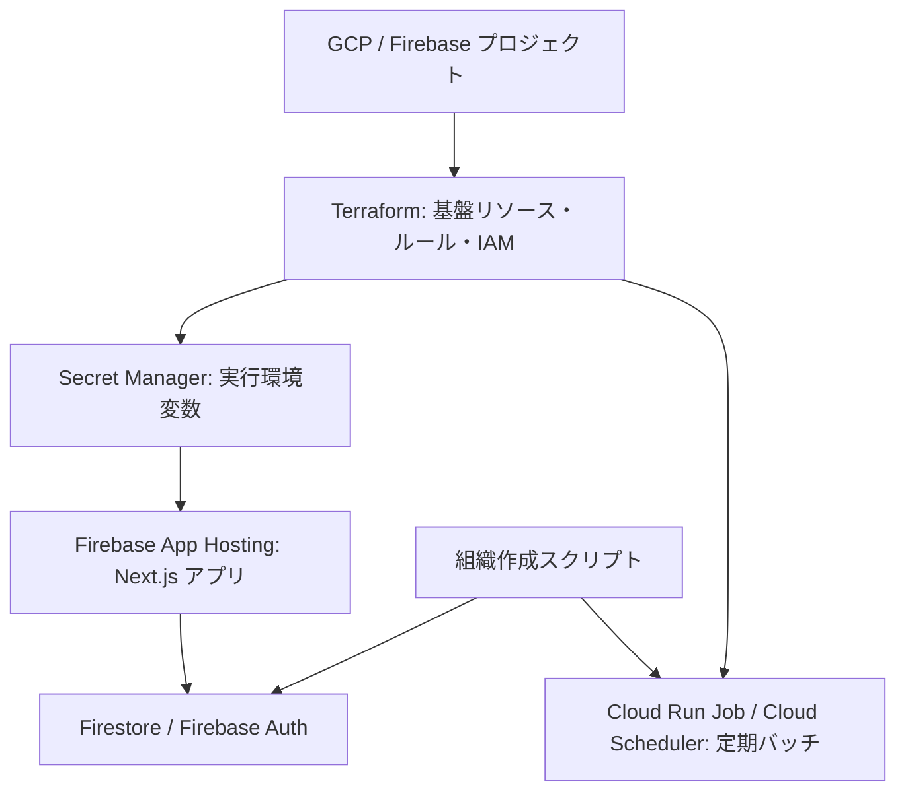

# システム環境構築・組織作成ガイド

このドキュメントは、Arc - 未来予報をローカルで起動し、Firebase / GCP 上の環境を用意して、最初の組織を利用可能にするまでの運用手順です。

> 対象環境は `dev`（`mirai-yoho-dev`）と `prod`（`mirai-yoho-prod`）です。開発・検証は必ず `dev` で行い、本番の Secret、Firestore、Firebase Auth を開発環境と共有しません。

## 全体像



組織を追加する時は、Firestore に組織・初期管理者・初期設定を作るだけでは完了しません。定期バッチを使う環境では、Terraform の `organization_ids` にも組織 ID を追加して apply します。

## 1. 事前準備

### 必要なツール

- Node.js 24.14.0、pnpm（[`mise.toml`](../mise.toml) を参照）
- Firebase CLI
- Google Cloud CLI（`gcloud`）
- Terraform 1.6 以上
- 対象 GCP プロジェクトを操作できる Google アカウント

Node.js / pnpm は mise を使う場合、リポジトリ直下で次を実行します。

```bash
mise install
pnpm install
```

`pnpm install` 時には Panda CSS と Orval の生成処理も実行されます。生成物の `src/generated/api/` と `src/generated/schemas/` は手で変更しません。

### Firebase / 外部サービスで用意するもの

環境ごとに、次の値を準備します。Secret の値をリポジトリ、Issue、チャットに貼り付けないでください。

| 区分 | 必要な値 | 用途 |
| --- | --- | --- |
| Firebase Client | API key、Auth domain、Project ID | ブラウザから Firebase Auth を使う |
| Firebase Admin | Project ID、サービスアカウントの client email / private key、Storage bucket | API・スクリプト・バッチから Firebase を管理する |
| Stripe | secret key、publishable key、webhook secret | 決済と Webhook 検証 |
| Zoom | Server-to-Server OAuth の Account ID / Client ID / Client Secret / Host User ID | Zoom 会議 URL の作成 |
| Resend | API key、送信元メールアドレス | 予約・招待メール |
| App | 公開 URL、インボイス登録番号、キャンセルトークン用の十分にランダムな secret | URL 生成・帳票・トークン検証 |
| LINE WORKS | 遅刻通知 Webhook URL | 遅刻通知バッチ（利用する場合） |

Firebase Authentication ではメール / パスワードと匿名ログインを有効にします。認可済みドメインには、ローカル開発用の `localhost` と各環境の公開ドメインを含めます。Terraform 管理下では `authorized_domains` がこの設定を更新します。

## 2. ローカル開発環境

### 2.1 環境変数を作る

`.env.example` をコピーして `.env.local` を作成し、対象環境の値を設定します。

```bash
cp .env.example .env.local
```

ローカルでメール送信を避けたい場合は、`EMAIL_DELIVERY_MODE=log` を設定します。設定しない場合の既定値は `resend` です。

`FIREBASE_PRIVATE_KEY` は、private key 内の改行を `\n` として 1 行で設定できます。サーバー側で実際の改行に復元されます。

`NEXT_PUBLIC_` 付きの値はブラウザに公開され、Next.js のビルド時に埋め込まれます。ここには Firebase Client 設定、Stripe publishable key、公開 URL だけを置き、secret key や private key を置かないでください。

### 2.2 Firestore への接続を確認する

`.env.local` の Firebase Admin 認証情報には、対象プロジェクトで Firestore と Firebase Auth を操作できるサービスアカウントを使います。コレクションのブートストラップを実行すると、全コレクションに `_bootstrap` ドキュメントが作られます。

```bash
make setup-firestore-collections
```

これは空のコレクションを Firestore Console に可視化するための処理です。アプリの通常動作に必須の業務データではありません。`_bootstrap` は削除しないでください。

### 2.3 起動と確認

```bash
pnpm dev
```

`http://localhost:3000` を開きます。初期管理者を作る前は、ログインしても組織ロールがないため管理 API にはアクセスできません。次章の組織作成を行ってください。

日常的な確認コマンドです。

```bash
pnpm lint
pnpm tsc
pnpm test
```

## 3. GCP / Firebase 基盤の初期構築

### 3.1 GCP プロジェクトと Firebase を準備する

環境ごとに GCP プロジェクトを作成して Firebase プロジェクトとして登録します。Firestore のロケーション、Firebase Storage のロケーションは後から変更できないため、作成前に確定してください。

Firebase App Hosting を使うため、Firebase GitHub App をリポジトリ `miyasan31/mirai-yoho` に接続します。Developer Connect 用 OAuth token の Secret version、GitHub App installation ID、接続 ID を取得し、Terraform 変数に設定します。

既存環境を Terraform 管理へ移す場合は、既存 Firebase Web App / App Hosting backend / Storage などを先に import してから apply してください。これらのリソースには削除保護が設定されています。

### 3.2 Terraform の環境設定

Terraform の環境別設定は次の場所です。

- `infra/terraform/dev/.tfvars` / `infra/terraform/dev/.backend.hcl`
- `infra/terraform/prod/.tfvars` / `infra/terraform/prod/.backend.hcl`

新しい環境を作る場合は `prod/.tfvars.example` をひな形にし、少なくとも次を環境に合わせて設定します。

- `project_id`、`app_base_url`、`organization_ids`
- Firestore / Storage のロケーションと Storage bucket 名
- Firebase Web App、App Hosting、Developer Connect / GitHub 接続に関する ID
- `authorized_domains` と `firebase_storage_cors_origins`

Terraform state 用 GCS bucket は Terraform の外で一度だけ作成します。開発環境の例です。

```bash
cd infra/terraform
make create-state-bucket ENV=dev
make auth-adc ENV=dev
make init ENV=dev
```

`auth-adc` は Application Default Credentials を設定します。実行者には、プロジェクトの API 有効化、IAM、Firestore、Storage、Secret Manager、App Hosting、Cloud Run、Cloud Scheduler を管理できる権限が必要です。

### 3.3 Worker イメージと初回 apply

Terraform は Cloud Run Job 用の `worker_image` を必須とします。一方で、初回は Artifact Registry がまだないため、以下の順番で進めます。

```bash
cd infra/terraform
export TF_VAR_worker_image="asia-northeast1-docker.pkg.dev/mirai-yoho-dev/batch-worker/worker:bootstrap"
terraform apply -var-file="dev/.tfvars" \
  -target=google_artifact_registry_repository.batch_worker

cd ../..
export IMAGE_TAG="$(git rev-parse HEAD)"
gcloud builds submit \
  --project="mirai-yoho-dev" \
  --config=cloudbuild.worker.yaml \
  --substitutions="_IMAGE=asia-northeast1-docker.pkg.dev/mirai-yoho-dev/batch-worker/worker:$IMAGE_TAG"

cd infra/terraform
export TF_VAR_worker_image="asia-northeast1-docker.pkg.dev/mirai-yoho-dev/batch-worker/worker:$IMAGE_TAG"
make plan ENV=dev
make apply ENV=dev
```

この apply で、主に以下が管理されます。

- Firestore Native database、複合インデックス、Firestore / Storage Security Rules
- Firebase Storage bucket、Firebase Authentication 設定、Firebase Web App
- App Hosting backend、実行用サービスアカウント、Secret 参照権限
- Secret Manager の Secret コンテナ（値そのものは含まない）
- Artifact Registry、Cloud Run Job、Cloud Scheduler、各サービスアカウントと IAM
- GitHub Actions 用 Workload Identity Federation

Cloud Scheduler / Worker の詳細は [Cloud Scheduler バッチ運用](cloud-scheduler.md) を参照してください。

### 3.4 App Hosting の Secret を登録する

Terraform apply 後、各 Secret に値を登録します。

```bash
make setup-secrets PROJECT=mirai-yoho-dev
```

App Hosting の変数は [`apphosting.yaml`](../apphosting.yaml) が正です。`NEXT_PUBLIC_*` の 5 項目はビルド時にも必要なため `BUILD` と `RUNTIME` の両方に公開されます。それ以外は Runtime Secret として扱います。

Firebase Console の App Hosting Environment variables に同名キーがあると、`apphosting.yaml` より優先されます。重複した環境変数は Console から削除または空にしてください。Secret の追加・更新後は App Hosting を再ロールアウトします。

Secret の詳しい運用・確認方法は [Firebase App Hosting Secret 運用手順](firebase-app-hosting-secrets.md) を参照してください。

### 3.5 継続デプロイ

`release/dev` または `release/prod` への push で、GitHub Actions が Worker イメージをビルド・push し、該当環境へ Terraform apply します。GitHub Environment ごとに `GCP_PROJECT_NUMBER` variable を設定し、`github-deployer` サービスアカウントへ Terraform state bucket の読み書き権限を付与してください。

App Hosting は Terraform の rollout policy により、`dev` では `release/dev`、`prod` では `release/prod` を監視します。

## 4. 組織作成フロー

### 4.1 組織 ID を決める

組織 ID は URL、Firestore のドキュメント ID、Cloud Scheduler ジョブ名の一部になります。小文字英字・数字・ハイフンだけを使い、後から変更しない前提で決めます。例: `tokyo-shibuya`。

> Terraform の `organization_ids` は `^[a-z0-9-]+$` の形式を要求します。大文字、空白、アンダースコアは使えません。

### 4.2 組織と初期管理者を作る

対象環境の `.env.local` を設定した端末で実行します。

```bash
make create-organization \
  ORGANIZATION_ID=tokyo-shibuya \
  ORGANIZATION_NAME="渋谷相談室" \
  ADMIN_EMAIL=admin@example.com
```

スクリプトは、同じ組織 ID が既にある場合は失敗します。安全のため既存組織を上書きしません。

実行時に行われる処理は次のとおりです。

1. `organizations/{organizationId}` に組織名と作成・更新時刻を保存する。
2. `ADMIN_EMAIL` の Firebase Auth ユーザーを取得する。存在しない場合はランダムな一時パスワードで作成する。
3. `organization-memberships/{organizationId}_{uid}` に `admin` ロールを保存する。未ログインのユーザーは `invited`、ログイン済みのユーザーは `active` になる。
4. `user-preferences/{uid}` の `lastOrganizationId` を新組織に設定する。
5. `organization-settings/{organizationId}` に初期設定を作成する。相談員選択は有効、初期ランクは `standard`（表示名: `標準`）である。
6. Firebase Auth のパスワード再設定リンクを出力する。新規ユーザーの場合は一時パスワードも標準出力に出る。

出力されるパスワード再設定リンクと一時パスワードは認証情報です。運用記録に残さず、安全な経路で初期管理者に渡してください。初期管理者はリンクからパスワードを設定します。

### 4.3 初回ログイン後の状態

認証済み API 呼び出しのたびに、対象ユーザーの `invited` membership は `active` に切り替わります。ログイン後に `/api/auth/me` で組織とロールを確認できます。

組織ごとの認可は、Firebase カスタムクレームではなく Firestore の `organization-memberships` を参照します。通常の組織運用で `make set-claims` を実行する必要はありません。このコマンドは旧来の互換用途に限ります。

初期管理者は、組織の管理画面から admin / operator / consultant を招待できます。招待時は Firebase Auth ユーザー、membership、必要に応じて consultant レコードが作られ、Resend によりパスワード再設定リンクを含む招待メールが送信されます。

### 4.4 定期バッチを有効にする

定期バッチを実行する環境では、組織作成後に `infra/terraform/<env>/.tfvars` の `organization_ids` に同じ ID を追加します。

```hcl
organization_ids = ["mirai-yoho-dev", "tokyo-shibuya"]
```

続けて Worker イメージを指定して apply します。

```bash
cd infra/terraform
export IMAGE_TAG="$(git rev-parse HEAD)"
export TF_VAR_worker_image="asia-northeast1-docker.pkg.dev/mirai-yoho-dev/batch-worker/worker:$IMAGE_TAG"
make plan ENV=dev
make apply ENV=dev
```

組織ごとに以下の Cloud Scheduler ジョブが作成されます（タイムゾーンは JST）。

| ジョブ | 実行頻度 | 目的 |
| --- | --- | --- |
| `batch-charge-<organizationId>` | 毎日 00:00 | 決済確定バッチ |
| `consultation-reminders-<organizationId>` | 15 分ごと | 相談リマインダー |
| `late-arrival-alerts-<organizationId>` | 30 分ごと | 遅刻通知 |

`organization_ids` を更新しない場合、その組織の定期バッチは作成されません。組織を廃止する際も、Firestore のデータを消す前にこのリストから削除して apply し、Scheduler を停止・削除する順序にしてください。

## 5. 作成後の確認チェックリスト

- [ ] `organizations`、`organization-memberships`、`organization-settings`、`user-preferences` に想定したドキュメントがある。
- [ ] 初期管理者がパスワードを設定し、ログイン後に対象組織へアクセスできる。
- [ ] `organization-memberships/{organizationId}_{uid}` が `role: admin`、初回認証後に `status: active` になっている。
- [ ] 管理画面で営業時間、料金範囲、相談員ランクなどを組織要件に合わせて設定した。
- [ ] 公開 URL の `/<organizationId>/consultants` と `/<organizationId>/booking` が正しい組織として表示される。
- [ ] Scheduler を利用する場合、`organization_ids` への追加と Terraform apply が完了し、3 種類のジョブがある。
- [ ] Secret の値が空でなく、App Hosting の重複 Environment variables がない。

## よくある問題

| 症状 | 確認・対処 |
| --- | --- |
| `User has no assigned role` | organization 作成時のメールアドレスとログインした Firebase Auth ユーザーが同じか、membership の `status` が `active` / `invited` かを確認する。 |
| `Organization '<id>' already exists` | 既存組織の上書きはできない。ID を確認し、既存データを利用するか別 ID を選ぶ。 |
| `No value for required variable worker_image` | `make plan` / `make apply` の前に `TF_VAR_worker_image` を設定する。 |
| App Hosting で Secret を読めない | Secret の存在・値・App Hosting 実行サービスアカウントの参照権限を確認し、再ロールアウトする。詳細は [Secret 運用手順](firebase-app-hosting-secrets.md) を参照。 |
| 定期バッチが対象組織に存在しない | `.tfvars` の `organization_ids` に組織 ID を追加して Terraform apply する。 |

## 関連ドキュメント

- [Firebase App Hosting Secret 運用手順](firebase-app-hosting-secrets.md)
- [Cloud Scheduler バッチ運用](cloud-scheduler.md)
- [DDD 設計](DDD_DESIGN.md)
